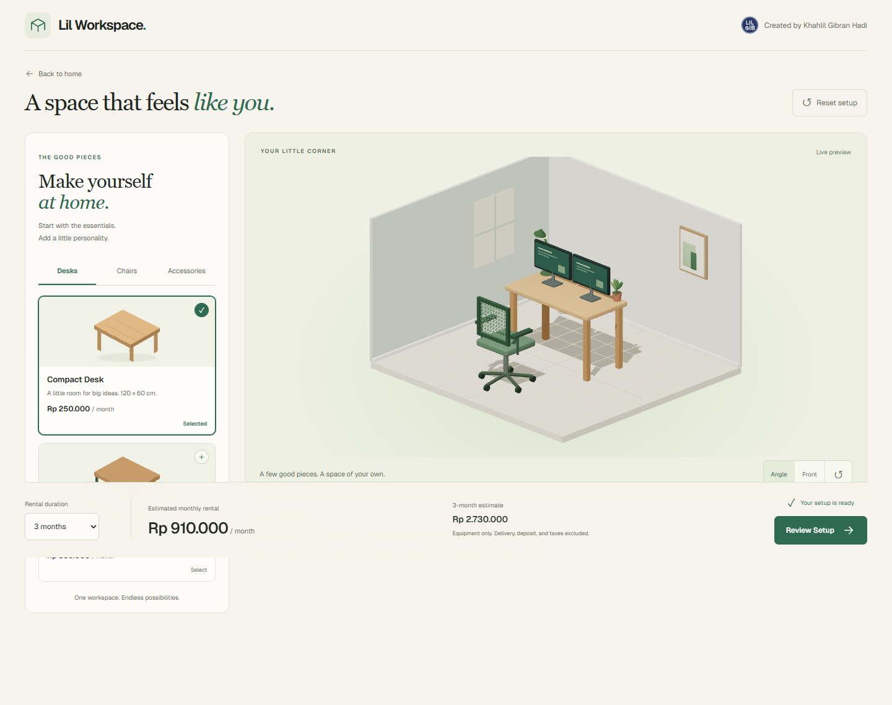
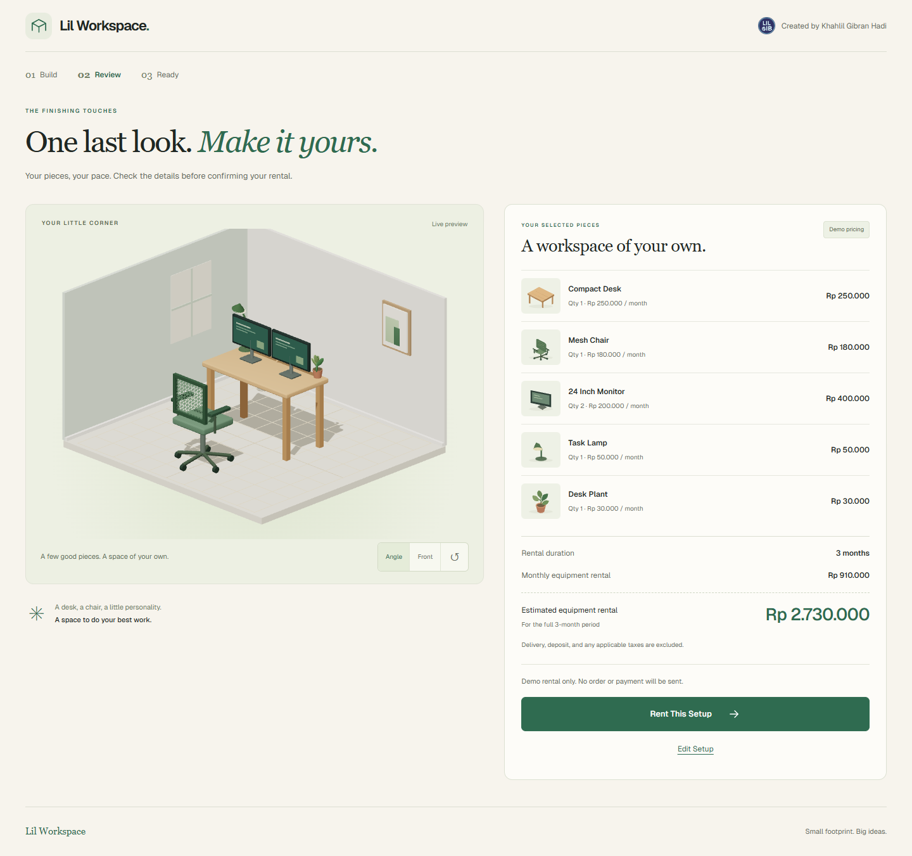
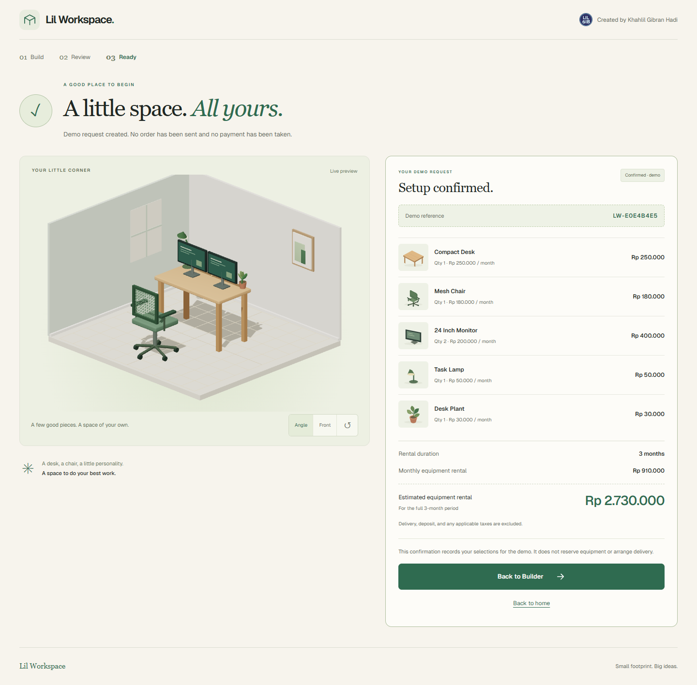

# 🪴 Lil Workspace

**Your workspace, your way.**

An interactive 3D workspace builder. Pick a desk, find your chair, add a few
extras, and watch your setup come together. See the rental estimate as you go
and come back to your saved workspace whenever you like.

Review your selected pieces, then confirm a demo rental with a snapshot of your
setup and a reference number.

> 🌐 **Live demo:** [View deployed app](https://lil-workspace.vercel.app/)








---

## 🌟 What it does

**🪵 Choose your essentials.** Start with a Compact or Wide Desk and a Mesh or
Ergonomic Chair. Switching desks keeps the rest of your setup in place.

**🖥️ Make it yours.** Add up to two monitors, a task lamp, and a desk plant.
Accessories unlock once you choose a desk.

**🧭 See it in 3D.** The room updates as you change your selections. Rotate the
view on desktop or switch between Angle and Front views on any device.

**💰 See the estimate immediately.** Choose a rental duration of 1, 3, or 6
months. Monthly and full-period estimates update with every change.

**💾 Pick up where you left off.** Your setup saves automatically in the same
browser. Resetting it asks for confirmation first.

**✅ Review and confirm.** Open the summary to see every item, quantity, and
subtotal. Edit your setup or choose Rent This Setup to create a demo
confirmation. No real order or payment is sent.

**📱 Build on a smaller screen.** The layout adapts to mobile, tablet, and
desktop. Touch devices keep normal page scrolling, and animations follow your
reduced-motion preference.

---

## 🧮 How rental estimates work

Every item has a monthly price in Indonesian rupiah. Quantities are applied
before the selected rental duration:

```text
monthly estimate = sum(item monthly price × quantity)
period estimate  = monthly estimate × rental months
```

For example, the setup pictured above comes to:

| Item | Quantity | Monthly subtotal |
| --- | --- | --- |
| Compact Desk | 1 | Rp250.000 |
| Mesh Chair | 1 | Rp180.000 |
| 24 Inch Monitor | 2 | Rp400.000 |
| Task Lamp | 1 | Rp50.000 |
| Desk Plant | 1 | Rp30.000 |
| **Total** | **6** | **Rp910.000** |

For three months, the estimate is **Rp2.730.000**. Prices are illustrative and
cover equipment only; delivery, deposits, and taxes are excluded.

---

## 🛠 Tech stack

| Layer | Choice | Reasoning |
| --- | --- | --- |
| Framework | Next.js 16 App Router, React 19 | Routes, metadata, and client-side builder components |
| Language | TypeScript 5 | Typed products, configuration, and component interfaces |
| 3D | Three.js, React Three Fiber, Drei | Procedural furniture, lighting, and camera controls |
| State | Zustand 5 | A workspace store scoped to its provider |
| Persistence | localStorage and sessionStorage | Save the setup across visits and the demo confirmation for the current tab |
| Styling | Tailwind CSS 4 and CSS | Responsive layouts, component styles, and motion preferences |
| Typography | Self-hosted Geist and Georgia | Body text and display headings without remote font requests |
| Hosting | Vercel | Live deployment |

---

## ⚙️ How it works

**The catalog is the source of truth.**
[`catalog.ts`](src/entities/product/model/catalog.ts) holds product IDs,
prices, quantity limits, and dimensions. Both the catalog UI and the scene use
these definitions.

**Configuration and pricing stay separate from rendering.**
[`configuration.ts`](src/features/configure-workspace/model/configuration.ts)
handles selections, accessory limits, saved-data validation, and totals.
Prices stay numeric until they are formatted for display.

**The builder and summary share one store.**
[`WorkspaceProvider`](src/_app/workspace-provider.tsx) creates a Zustand store,
restores the saved configuration after hydration, and persists changes under
`lil-workspace:configuration`. Unavailable storage does not prevent editing.

**Furniture is built from geometry.**
[`furniture.tsx`](src/widgets/workspace-preview/ui/furniture.tsx) defines desks,
chairs, monitors, lamps, and plants without external model or texture downloads.
Accessories follow the selected desk's dimensions.

**A confirmation captures the setup at that moment.**
[`submit-rental`](src/features/submit-rental/model/rental.ts) validates the
configuration and creates an independent snapshot with a demo reference.
Repeated clicks create one confirmation. Editing the setup clears it; a
matching confirmation can survive a reload in the same tab when browser
storage is available.

**The splash stays light.** The home page uses the static WebP hero image from
`public/lil-workspace-hero.webp`, served through Next.js Image. The 3D scene
loads dynamically in the builder and summary and renders on demand. If the
preview fails, your selections remain available and you can retry it.

---

## 🖱️ Controls

| Action | Desktop | Touch |
| --- | --- | --- |
| Select furniture | Click a product card | Tap a product card |
| Change accessories | Use quantity buttons or toggles | Use quantity buttons or toggles |
| Rotate the scene | Click and drag within the preview | Use the view buttons |
| Switch camera view | Angle or Front button | Angle or Front button |
| Reset camera | Reset view button | Reset view button |
| Start over | Reset setup, then confirm | Reset setup, then confirm |

Camera rotation is constrained; pan and zoom are disabled. Catalog tabs also
support keyboard navigation with arrow keys, Home, and End.

---

## 🚀 Running locally

Use **Node.js 22.12 or newer**. From the project directory:

```bash
npm install
npm run dev
```

Open [http://localhost:3000](http://localhost:3000), then choose **Start Building**
or go directly to [`/builder`](http://localhost:3000/builder).

| Command | Description |
| --- | --- |
| `npm run dev` | Start the development server |
| `npm run build` | Create a production build in `.next/` |
| `npm run start` | Serve the production build |
| `npm run lint` | Run ESLint |

On Windows PowerShell, use `npm.cmd` if your execution policy blocks `npm.ps1`.

---

## 📦 Project layout

```text
src/
├── app/                         Next.js routes, metadata, and route styles
├── _app/                        Workspace provider and persistence
├── _pages/
│   ├── splash/                  Home page composition
│   ├── builder/                 Builder page composition
│   └── summary/                 Review and demo confirmation
├── widgets/
│   ├── catalog-panel/           Furniture and accessory controls
│   └── workspace-preview/       3D scene, furniture, and preview recovery
├── features/
│   ├── configure-workspace/     Selection rules, totals, and view model
│   └── submit-rental/           Validated demo requests and snapshots
├── entities/
│   ├── product/                 Catalog, prices, and product thumbnails
│   └── workspace/               Configuration types and Zustand store
└── shared/                      Branding, reusable UI, and browser hooks

public/fonts/                    Self-hosted Geist and its license
docs/images/                     README screenshots
```

The routes compose pages and providers; pages compose widgets. Product and
workspace data live in entities, while shared components supply branding,
creator credits, and the splash hero image.

---

## ⚠️ Known limitations

- The checkout and confirmation are a demo. Rental prices are illustrative,
  with no live inventory, real order submission, or payment integration.
- Saved setups belong to one browser and do not sync across devices.
- The 3D preview requires WebGL2. If it is unavailable, the catalog and pricing
  controls remain usable.
- Furniture positions are predefined; items cannot be dragged around the room.

---

Built by [Khahlil Gibran Hadi](https://github.com/lilgibs).
